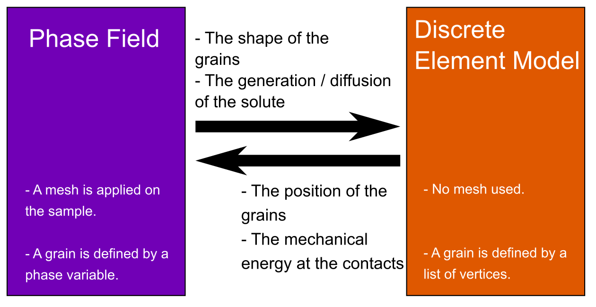

# MY_PFDEM_2G_2D

Phase-Field Discrete Element Modelisation with solute generation applied to two grains. It uses Moose (PF) and Yade (DEM) softwares.

## Simulation presentation
The goal is to simulate the pressure solution phenomena (illustrated by the following scheme) between two grains.

## Technical description
The PFDEM is a discussion between phase-field (PF) simulation and discrete element modelization (DEM). Even if those formulations are different, they can collaborate with data exchange.

The [phase-field theory](https://en.wikipedia.org/wiki/Phase-field_model) is based on the mesh of the sample and grains are represented by a phase variable (= 1 if the node is a grain, = 0 else). This formulation transmit to the DEM the shape of the grain. Hence, a grain detection algorithm is used to extract the shape from the phase field. In this case, no information about the solute is needed as it is assumed the solute is instantaneously evacuated.

The [discrete element model](https://en.wikipedia.org/wiki/Discrete_element_method) does not need mesh and grains are represented by a list of planes (here potential blocks are assumed). The role of the DEM is to compute the position of the grains. Then, an algorithm is used to convert the grain position into a new phase-field.

A back and forth is done between phase-field (PF) simulation and discrete element modelisation (DEM). Hence, once a steady-state is reached with the DEM, the phase-field theory is called. The shape of the grains will change and the steady state is not verified and must be computed by a new DEM step.
The following schemes illustrate the algorithm.

Phase-field approach is computed with [MOOSE](https://github.com/idaholab/moose) and DEM is computed with [Yade](https://yade-dem.org/doc/) (the solvers must be correctly installed). The launch of this project is done by executing the python script <i>main.py</i>. The user can change variables inside the python script <i>Parameters.py</i>.

A [documentation](??) for the python script will be available soon.

### Phase-field
The goal of the phase-field step is to compute the shape of the grains as it evolves with the precipitation/dissolution.
An Allen-Cahn formulation is used coupled with a solute generation and diffusion. Hence, the conservation of the mass should be verified as precipitation/dissolution occurs.

### DEM
The goal of the DEM step is to compute a steady-state configuration. Grains are assumed as polygons. The shape is computed from an interpolation of the phase variable.

## What is next ?
Some next releases are presented here.

- write the online documentation
- publish an article about the simulation and result
